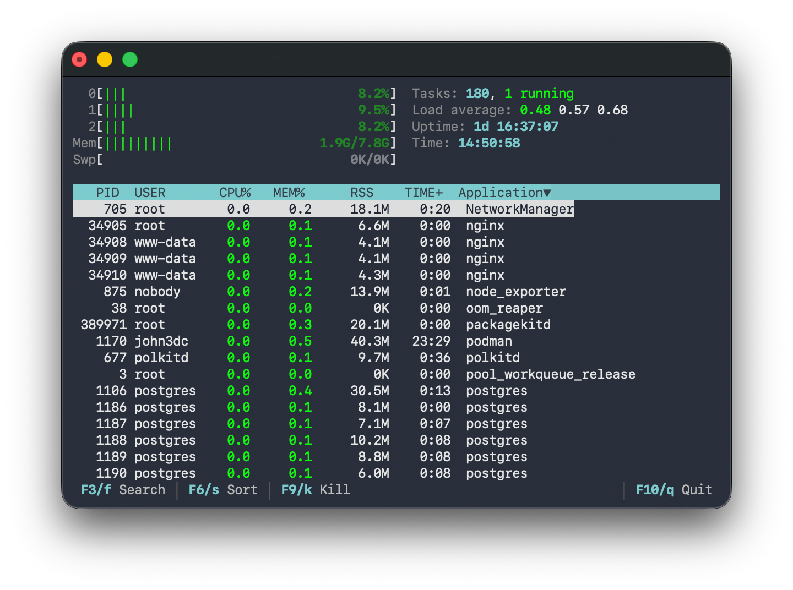

# litetop

A minimal htop-like system monitor for the Linux terminal

- htop-style header: per-core CPU + memory + swap meters on the left,
  tasks / load average / uptime / time on the right
- live process list, real per-process CPU% (delta sampled), sort by PID / CPU / MEM / application
- selectable rows (the selection stays on its row position across refreshes)
- search/filter and sort via litefm-style overlay boxes (F3 / F6)
- mouse: click a row to select, click a column header to sort, wheel to scroll
- F9 sends a signal to the selected process (pick from a menu), result in the footer
- one C file, only libc — (~28 KB binary), reads only `/proc`




## Build

Needs only a C compiler + libc:

```sh
cc -O2 -Wall -o litetop litetop.c
./litetop
```


### Install (optional)

```sh
sudo cp litetop /usr/local/bin/
```


## Keys

| key                | action                                  |
|--------------------|-----------------------------------------|
| `q` / `F10`        | quit                                    |
| `F3` / `f`         | search — overlay filters the list live  |
| `F6` / `s`         | sort — overlay to pick the column       |
| `p` `c` `m` `a`    | quick sort by PID / CPU% / MEM% / app   |
| `↑` `↓`            | move the selection                      |
| `PgUp` `PgDn`      | move a page                             |
| `Home` `End`       | jump to first / last process            |
| `F9` / `k`         | send a signal — overlay to pick which   |
| mouse click        | select a row, or sort via header        |
| mouse wheel        | scroll the list                         |

In the **search** overlay type to filter by command or user name (Enter keeps
the filter, Esc clears it). The **sort** overlay offers CPU% / MEM% / TIME+ /
RSS / PID / Application — arrows + Enter, or click an entry. The **signal**
overlay (F9) lists SIGTERM / SIGKILL / SIGHUP / SIGINT / SIGQUIT / SIGSTOP /
SIGCONT / SIGUSR1 / SIGUSR2 — pick one and it is sent to the selection.

The view refreshes every 1.5 s; keypresses and clicks repaint immediately.
